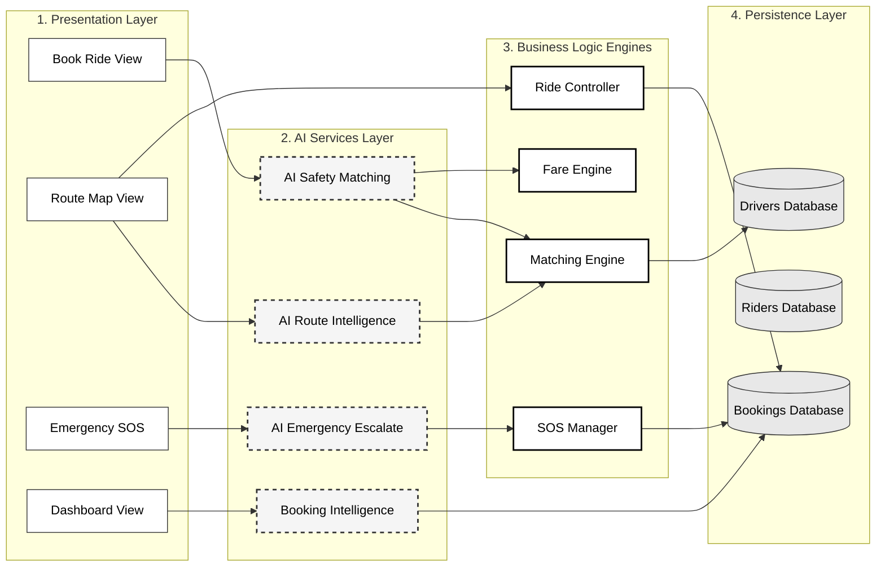
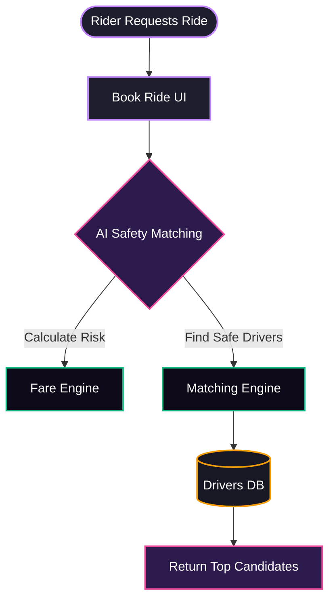
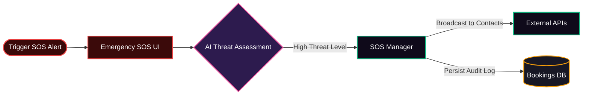

# SafeHer Ride: System Architecture Visuals

This document contains the professional visual conversions of the SafeHer Ride system architecture. These are optimized for different presentation mediums while strictly preserving the underlying architecture logic.

## 1. Professional Visual Block Diagram (Presentation Ready)
*Optimized for PowerPoint, Keynote, and Project Presentations. Uses a clean, colorful layout to distinguish layers.*

```mermaid
graph TD
    classDef frontend fill:#2a1b42,stroke:#c084fc,stroke-width:2px,color:#fff,rx:5px,ry:5px;
    classDef aiEngine fill:#381a3d,stroke:#ec4899,stroke-width:2px,color:#fff,rx:5px,ry:5px;
    classDef coreEngine fill:#132a22,stroke:#10b981,stroke-width:2px,color:#fff,rx:5px,ry:5px;
    classDef database fill:#31220f,stroke:#f59e0b,stroke-width:2px,color:#fff,rx:10px,ry:10px;

    subgraph Front["📱 Frontend Layer (Streamlit)"]
        direction LR
        A[Book Ride UI]:::frontend
        B[Live Route Map UI]:::frontend
        C[Emergency SOS UI]:::frontend
        D[Driver Dashboard UI]:::frontend
    end

    subgraph AI["🧠 AI Intelligence Layer"]
        direction LR
        AI_Match[AI Safety Matching\n(Confidence & Risk)]:::aiEngine
        AI_Route[AI Route Intel\n(Safety & ETA)]:::aiEngine
        AI_SOS[AI SOS Escalation\n(Threat Assessment)]:::aiEngine
        AI_Dash[Booking Intel\n(Demand Positioning)]:::aiEngine
    end

    subgraph Core["⚙️ Core Operational Engines"]
        direction LR
        M_Engine[Matching Engine\n(Shortest Path)]:::coreEngine
        F_Engine[Fare Engine\n(Dynamic Pricing)]:::coreEngine
        R_Control[Ride Controller\n(Lifecycle)]:::coreEngine
        S_Manager[SOS Manager\n(Alerts)]:::coreEngine
    end

    subgraph DB["💾 Data Storage Layer"]
        direction LR
        DB_Drivers[(Drivers Database)]:::database
        DB_Riders[(Riders Database)]:::database
        DB_Bookings[(Bookings History)]:::database
    end

    %% High-level connections for structural visual
    Front --> AI
    AI --> Core
    Core --> DB
    
    %% Specific Action Flows
    A -.->|1. Request| AI_Match
    B -.->|Fetch Data| AI_Route
    C -.->|Trigger Alert| AI_SOS
    D -.->|Analytics| AI_Dash

    AI_Match -.->|2. Candidates| M_Engine
    AI_Match -.->|3. Pricing| F_Engine
    AI_Route -.->|Simulate| M_Engine
    B -.->|State| R_Control
    AI_SOS -.->|Assess Threat| S_Manager

    M_Engine -.->|Fetch| DB_Drivers
    R_Control -.->|Update| DB_Bookings
    S_Manager -.->|Update| DB_Bookings
    AI_Dash -.->|Analyze| DB_Bookings
```

## 2. Internship Report Diagram (Academic / Formal)
*Optimized for PDFs, documentation, and formal reports. Uses high-contrast grayscale patterns and left-to-right flow for readability.*



## 3. Clean Flowcharts by Layer

### A. Core Workflow (Book & Dispatch)


### B. Emergency SOS Architecture Flow

